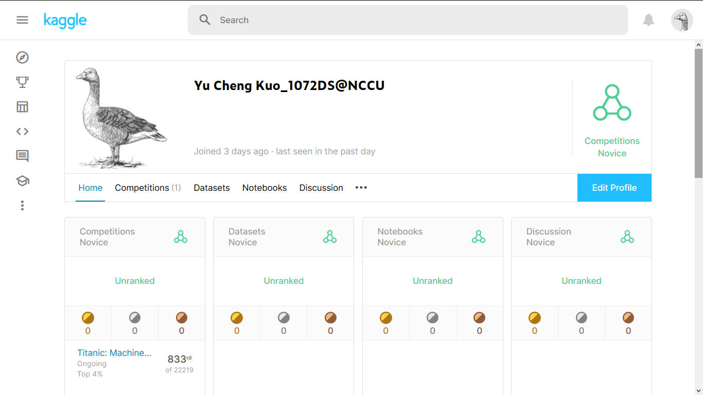
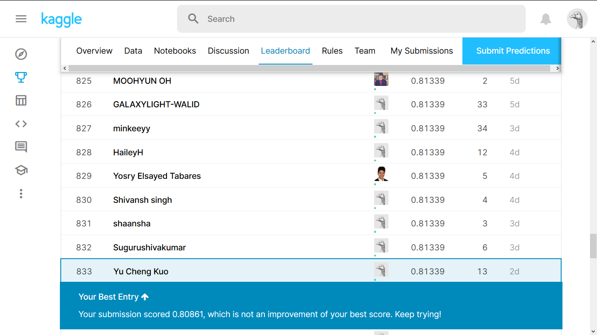
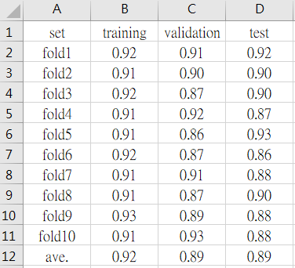
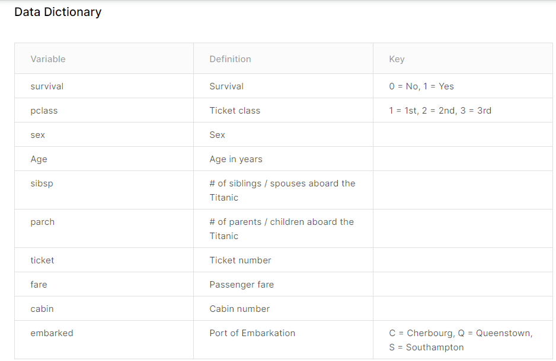

# Top_4_pct_Titanic_Kaggle
Top 4 % (833/22219) in **[Titanic: Machine Learning from Disaster](https://www.kaggle.com/c/titanic)**, an iconic entry-level competition on Kaggle, in 2020/05. This analysis was ***conducted with R***.

## Outline
1. Ranking 
2. Dataset
3. Steps
4. Reproducing Outcome on Training Data Given by Kaggle
5. The Public Leaderboard Ranking and Score on Kaggle
6. Details \
*6-1 Introduction to Features \
*6-2 Missing Values Imputation \
*6-3 Features Transformation \
*6-4 Feature Extraction \
*6-5 Model Selection 

## 1. Ranking 




## 2. Dataset

The Titanic dataset here is retrieved from Kaggle in 2020/05. Notice that **the Titanic dataset has changed now**, so my top 4% ranking in Titanic disappeared. Kaggle ***deleted the feature "Name"***, probably for ***preventing cheating***, and resampled to get the new data. 

## 3. Steps

1. Performing **10-fold** cross-validation under **3-way** split to select the best prediction model. (Doing k-fold CV in training data given by Kaggle.)
2. Reporting the average accuracy of cross-validation (training, validation, test in *n*-fold cross-validation).
3. Applying the selected model on the test data.

## 4. Reproducing Outcome on Training Data Given by Kaggle

I got a 0.89 accuracy on test data using **Random Forest** with 10-fold under 3-way split.

 \
Run the following snippet in "Terminal" of *RStudio* to get the outcome.
```R
Rscript Titanic_Kaggle_Morton_Kuo.R --fold 5 --train Titanic_Data/train.csv --test Titanic_Data/test.csv --report performance1.csv --predict predict.csv
...
Rscript Titanic_Kaggle_Morton_Kuo.R --fold 10 --train Titanic_Data/train.csv --test Titanic_Data/test.csv --report performance6.csv --predict predict.csv
```

## 5. The Public Leaderboard Ranking and Score on Kaggle

Top 4% (833/22219) and a 0.81339 accuracy on public leaderboard in 2020/05. However, you CAN'T get exactly the same public leaderboard score merely submitting my result since the Titanic dataset has changed.

## 6. Details

### 6-1 Introduction to Features

 \
This snapshot was taken in 2021/03. The feature "Name" has been deleted at this point. Amid these 10 variables, "survival" is clearly the target and the rest 9 variables are all features. So I had 10 features at the time (2020/05) I did this analysis. 

### 6-2 Missing Values Imputation
```R
mice.data <- mice(Raw,
                  m = 1,            
                  maxit = 50,      # max iteration
                  method = "rf", 
                  seed = 188,
                  print=FALSE)     
```
I imputed 7 features (Sex, Age, SibSp, Parch, Fare, Pclass, Embarked), leaving the left 3 features (Name, Ticket, Cabin) remained. "Name" & "Ticket" don't have any missing values but "Cabin" possesses lots of missing values. We will tackle with "Cabin" in 6-3.

Actually, I made mistake called **"data leakage"**, a common mistake in DS & ML projects, while imputing the missing values. I merged the training and test dataset given by Kaggle, then imputing this merged dataset by Random Forest using mice(). I should have imputed the missing values of training and test dataset respectively! This mistake might have caused overfitting.

### 6-3 Features Transformation

Total 10 features. Through inspecting cross table of the target "survival" and every feature respectively, I was able to unveil how to split the non-numeric data into categories distinguishable by "survival". As for numeric data, in reality, I tried log transformation and converting numeric data into categorical data, but none of them worked.

#### 6-3-1 Name
```R
table(Survived_train , Titanic$Title[1:891])
```
Again, notice that this feature doesn't exist in Titanic dataset on Kaggle anymore. Yet it existed in 2020/05, the time I carrying out this analysis. According to a resource on Kaggle, I extracted the title of "Name" only. Then, I observed the cross table of "Survival" & "Title", and categorized "Title" as followed:

A. "RARE" : "Jonkheer.", "the", "Don.", "Dona.", "Sir.", "Lady.", "Mme."\
B. "Prof": "Dr.", "Rev.", "Capt.", "Major.", "Col."\
C. "Mr": "Mr."\
D. "Master": "Master."\
E. "Mrs":"Mrs.", "Ms."\
F. "Miss": "Miss.", "Mlle."

#### 6-3-2 Sex
No change.

#### 6-3-3 Age
No change.

#### 6-3-4 SibSp & Parch
```R
Titanic_temp$Family_size = (Titanic_temp$SibSp + Titanic_temp$Parch +1 )
table(Survived_train, Titanic_temp$Family_size[1:891])

Titanic_temp$Family_size [ Titanic_temp$Family_size == 11 ] = "D"
Titanic_temp$Family_size [ Titanic_temp$Family_size == 8 ] = "D"
Titanic_temp$Family_size [ Titanic_temp$Family_size == 7 ] = "C"
Titanic_temp$Family_size [ Titanic_temp$Family_size == 6 ] = "C"
Titanic_temp$Family_size [ Titanic_temp$Family_size == 5 ] = "C"

Titanic_temp$Family_size [ Titanic_temp$Family_size == 4 ] = "B"
Titanic_temp$Family_size [ Titanic_temp$Family_size == 3 ] = "B"
Titanic_temp$Family_size [ Titanic_temp$Family_size == 2 ] = "B"

Titanic_temp$Family_size [ Titanic_temp$Family_size == 1 ] = "A"
```
Creating a new features combining "SibSp" & "Parch". Then classifying them into 4 categories referring to the cross table of "Survival" & "Family_size".


#### 6-3-5 Ticket
After observing the cross-table of "the first alphabet of ticket" & "survival",  I classified the ticket numbers into 2 categories.

#### 6-3-6 Fare
No change.

#### 6-3-7 Pclass
No change.

#### 6-3-8 Cabin
```R
table(Survived_train, cabin02[1:891])
```
By obeserving the cross-table, I categorized "Cabin" into 2 category, making NAs into a category and made the rest non-NA elements into another.

#### 6-3-9 Embarked
No change.

### 6-4 Feature Extraction
I figured that this part is the reason why I got top 4% ranking merely using one model, Random Forest, without leveraging stacking.

Leveraging stepwise linear regression with higher degree terms & interactions (using *stepwise( )*), I was able to choose a few influential features.

### 6-5 Model Selection
Then, I input those influential features to models, and tried combinations of those features in every model. The models I tried ranging from Naive Bayes, Linear Regression, SVM, Random Forest, XGBoost to Neural Network. Ultimately, I found that Ramdom Forest yielded the best results.

Here are a couple of best models I came by. Note that I ***didn't even adopt stacking*** but already got a satisfactory top 4% (833/22219) ranking. 
```R
fold1_rf   = randomForest( Survived ~ Title + Family_size:Sex_Survival + Fare + Embarked , data= Titanic_train , ntree = 1000, importance = F)
fold1_rf01 = randomForest( Survived ~ Title + Family_size:Sex_Survival + Fare + Embarked , data=Titanic_train , ntree = 1000, importance = F)
fold1_rf02 = randomForest( Survived ~ Title + Family_size:Sex_Survival + Fare:Age + Embarked + Ticket_02 , data=Titanic_train , ntree = 1000, importance = F)
```
